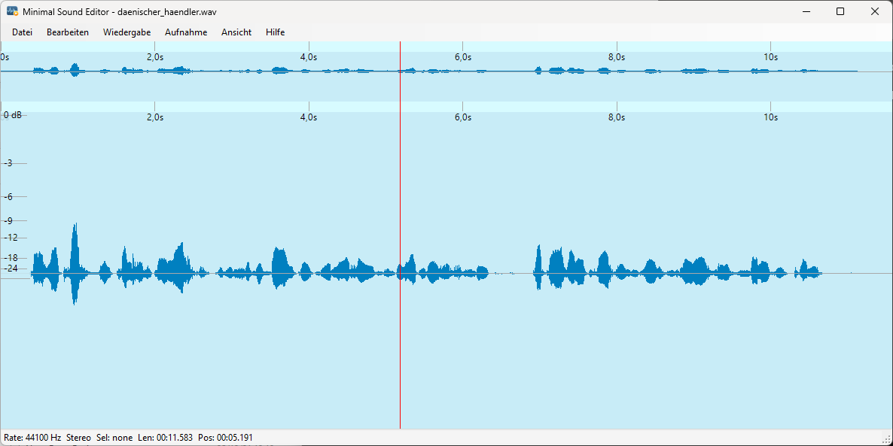

# Minimal Sound Editor

<p align="center">
  
</p>

<p align="center">
  <a href="https://github.com/DINmatin/MinimalSoundEditor/releases/latest"></a>
  <a href="LICENSE"></a>
  
</p>

Ein kompakter Audio-Editor für Windows, geschrieben in C# mit .NET WinForms. Der Schwerpunkt liegt auf schnellem Schneiden, einfachen Bearbeitungen und einer kleinen ASIO-Aufnahmelösung ohne überladene DAW-Oberfläche.

## Download

Die aktuelle Version liegt unter [GitHub Releases](https://github.com/DINmatin/MinimalSoundEditor/releases/latest):

- `MinimalSoundEditor_Setup_1.0.0.exe` – Installer für Windows x64
- `MinimalSoundEditor_Portable_1.0.0_win-x64.zip` – portable Version
- `SHA256SUMS.txt` – Prüfsummen der veröffentlichten Dateien

Der Installer benötigt Administratorrechte und installiert standardmäßig nach `C:\Program Files\Minimal Sound Editor`. Die portable Version kann in einen beliebigen Ordner entpackt und direkt über `MinimalSoundEditor.exe` gestartet werden.

> Der Installer ist derzeit nicht digital signiert. Windows SmartScreen kann deshalb beim ersten Start eine Warnung anzeigen.

## Funktionen

- übersichtliche Wellenform mit Detail- und Gesamtansicht
- Auswahl, Löschen, Kopieren, Einfügen und überschreibendes Einfügen
- Normalisieren, Komprimieren, Fade-in, Fade-out und Stille trimmen
- Stille einfügen oder ausgewählte Bereiche stummschalten
- Wiedergabe, Loop, Auto-Follow und Zoom auf Auswahl
- einheitlicher **Export**: Auswahl exportieren; ohne Auswahl den gesamten Clip
- Export als WAV, FLAC, MP3 oder M4A
- ASIO-„Mini-Studio“ mit Treiber-, Eingang- und Samplerate-Auswahl
- Live-Eingangspegel, Clip-Warnung und Mono-Aufnahme direkt in den Editor
- Stapelverarbeitung
- Video-Vorschau und FFmpeg-gestützte Medienfunktionen

Die ASIO-Aufnahme wurde mit einer **MOTU M4** getestet. Andere ASIO-Geräte sollten ebenfalls funktionieren, sofern ein passender Windows-ASIO-Treiber installiert ist.

## Systemanforderungen

- Windows 10 oder Windows 11, 64 Bit
- für ASIO-Aufnahmen: installierter ASIO-Treiber des Audio-Interfaces
- für einen Build aus dem Quellcode: .NET 8 SDK
- für den Installer-Build: Inno Setup 6

Installer und portable ZIP werden self-contained gebaut. Auf dem Zielrechner muss daher kein separates .NET Runtime-Paket installiert sein.

## Bedienung

1. **Datei → Öffnen…** lädt eine Audio- oder unterstützte Mediendatei.
2. Einen Bereich in der Wellenform markieren und über **Bearbeiten** verändern.
3. **Datei → Export…** exportiert die Auswahl. Ohne aktive Auswahl wird der gesamte Clip exportiert.
4. **Aufnahme → Mini-Studio…** öffnet die ASIO-Aufnahme mit Live-Pegel.

Wichtige Tastenkürzel:

| Funktion | Kürzel |
|---|---|
| Öffnen | `Ctrl+O` |
| Export | `Ctrl+E` |
| Rückgängig | `Ctrl+Z` |
| Alles auswählen | `Ctrl+A` |
| Mini-Studio | `Ctrl+R` |
| Wiedergabe/Pause | `Leertaste` |
| Loop | `L` |

## Aus dem Quellcode bauen

Repository klonen und in den Projektordner wechseln:

```cmd
git clone https://github.com/DINmatin/MinimalSoundEditor.git
cd MinimalSoundEditor
```

FFmpeg wird wegen seiner Größe und separaten Lizenz **nicht** im Git-Repository gespeichert. Für die FFmpeg-gestützten Funktionen muss lokal eine passende Datei hier liegen:

```text
Tools\ffmpeg.exe
```

Danach:

```cmd
dotnet restore
dotnet build .\MinimalSoundEditor.csproj
.\bin\Debug\net8.0-windows\MinimalSoundEditor.exe
```

## Release und Installer bauen

Benötigt werden:

- .NET 8 SDK
- Inno Setup 6
- eine geprüfte `Tools\ffmpeg.exe`

Im Repository-Stamm:

```cmd
scripts\build-release.cmd 1.0.0
```

Die Ergebnisse liegen anschließend unter:

```text
artifacts\installer\MinimalSoundEditor_Setup_1.0.0.exe
artifacts\portable\MinimalSoundEditor_Portable_1.0.0_win-x64.zip
artifacts\SHA256SUMS.txt
```

Das Build-Skript protokolliert zusätzlich die tatsächlich verwendete FFmpeg-Version als `FFMPEG_BUILD_INFO.txt` im Release-Paket.

## Projektstruktur

- `MainForm.cs` – Hauptfenster, Auswahlbearbeitung und Exportabläufe
- `MainForm.Logic.cs` – Audiozustand, Laden, Speichern, Wiedergabe und Themes
- `MainForm.Menu.cs` – textbasierte Menüoberfläche
- `MainForm.Recording.cs` – ASIO-Vorschau und Aufnahme
- `WaveformView.cs` – Darstellung, Auswahl und Navigation der Wellenform
- `AudioIo.cs` / `AudioOps.cs` – Audio-Ein-/Ausgabe und Bearbeitungsoperationen
- `Batch*.cs` – Stapelverarbeitung
- `installer/` und `scripts/` – Installer- und Release-Erzeugung

## FFmpeg-Hinweis

Einige Export- und Medienfunktionen starten `Tools\ffmpeg.exe` als separates Kommandozeilenprogramm. FFmpeg ist nicht Teil des Quellcode-Repositories. Release-Ersteller müssen die Lizenz des konkret verwendeten Builds prüfen und die zugehörigen Lizenz- und Quellcodepflichten erfüllen. Siehe [THIRD_PARTY_NOTICES.md](THIRD_PARTY_NOTICES.md).

## Lizenz

Der eigene Quellcode von Minimal Sound Editor steht unter der [MIT-Lizenz](LICENSE). Drittanbieter-Komponenten behalten ihre jeweiligen Lizenzen.
